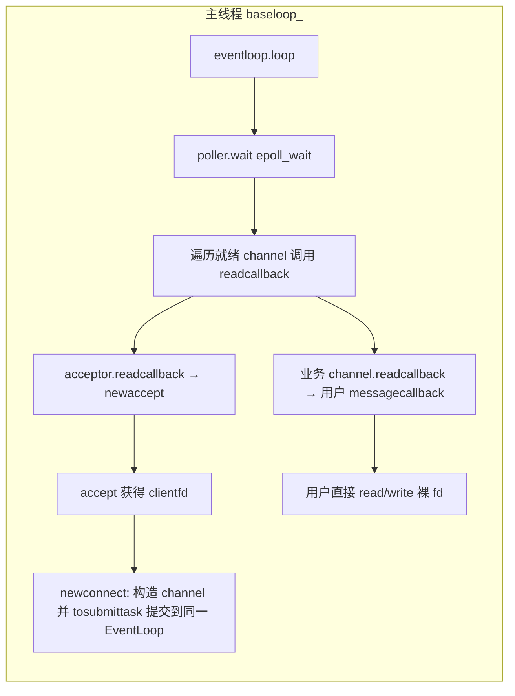

# muduo 库现状评估与重构规划文档

> 文档版本：v1.0 ｜ 评审对象：`muduo/`（网络库）+ `stl/`（模板元编程库）｜ 基线：当前分支 `C++_CMake_Project_Socket_Sever`
> 评审角色：资深 C++ 后端架构师 ｜ 评审日期：2026-08-24

---

## 0. 结论摘要（TL;DR）

这是一个**能编译、能跑通基本 accept/read 流程的"单线程 Reactor 演示"**。它的骨架（EventLoop + Channel + Poller + Acceptor）方向是对的，但距离"工业级/工程化高性能网络库"存在 **三个层次的硬伤**：

1. **正确性风险**：几乎所有系统调用忽略错误码；`poller` 事件数组固定 10 个会丢事件；`channel` 与 `poller` 之间存在裸指针 + 无限 `EPOLL_CTL_ADD`；无 `SO_REUSEADDR` / `SIGPIPE` 处理，线上必挂。
2. **架构半成品**：`tcpthread` 已写好却被注释掉，线程模型退化为单线程；无 `Buffer`、无 `TimerQueue`、无连接生命周期管理；`tcpserver` 构造函数里直接阻塞进 `loop()`。
3. **工程化缺失**：循环 `#include`、命名混乱、调试 `cout` 满天飞、无日志/异常/测试体系、CMake 使用 `file(GLOB)`。

好消息是：**重构成本完全可控**，且我已在文档末尾给出 5 阶段路线图。按路线图迭代，可以循序渐进地把这个 Demo 打磨成真正拿得出手的作品。

---

## 1. 项目架构全景剖析

### 1.1 模块划分

当前代码可划分为两大子系统：

| 子系统 | 目录 | 职责 | 成熟度 |
|---|---|---|---|
| **网络库** | `muduo/` | 仿 muduo 的 Reactor 网络库（编译为静态库 `muduo`） | ⭐⭐（Demo 级） |
| **模板库** | `stl/` | 自研元编程/容器练习（tuple、bind、function、FFT 蝶形、线程封装），编译为 INTERFACE 库 `stl_core` | ⭐⭐⭐（练习性质，未与网络库深度耦合） |
| 主程序 | `src/main.cpp` | 正式入口 | 空壳（`main` 里几乎无逻辑） |
| 测试 | `test/` | `test_main`，当前仅跑一个 FFT 蝶形测试 | ⭐（无断言） |

**网络库内部类（Reactor 模式五件套）：**

| 类 | 对应 muduo 原版 | 当前实现要点 | 状态 |
|---|---|---|---|
| `eventloop` | `EventLoop` | epoll 封装 + eventfd 唤醒 + pending functor 队列 | 缺退出机制、缺线程检查 |
| `poller` | `Poller/EPollPoller` | epoll_wait 封装 | 事件数组固定 10、无限 ADD |
| `channel` | `Channel` | fd + 回调绑定 | 裸引用回调、无事件类型分发 |
| `acceptor` | `Acceptor` | listen socket + accept | 硬编码端口、单次 accept |
| `tcpserver` | `TcpServer` | 组织者 + 连接容器 | 构造即阻塞、无连接管理 |
| `tcpconnection` | `TcpConnection` | channel 的薄包装 | 无读写/状态/关闭 |
| `tcpthread` | `EventLoopThread` | 子线程 EventLoop + 条件变量同步 | ✅ 已实现但**未接入** |

> 注：与真 muduo 相比，**缺失**的组件包括：`Buffer`、`InetAddress`、`Socket`、`TimerQueue`、`EventLoopThreadPool`、`Connector`、`TcpClient`、日志库、`Timestamp`、回调类型体系（ConnectionCallback/MessageCallback 等）。

### 1.2 核心数据流

当前（实际生效的）数据流：

**线程模型（现状）**：`MainReactor 单线程` —— `tcpserver` 构造时创建唯一一个 `eventloop`，所有监听、接受、业务读写全部在**一个线程**里完成。`tcpthread` 的代码已就绪，但 `tcpserver::newconnect` 中的 `thread.geteventloopptr()` 被注释，**多线程模型（one loop per thread）尚未落地**。

---

## 2. 现状诊断与工程化短板评估

### 2.1 代码规范与现代化 C++（得分：4/10）

| 问题 | 位置 | 严重度 | 说明 |
|---|---|---|---|
| **循环 include** | `channel.h`⇄`eventloop.h`⇄`poller.h` | 🔴 高 | `channel.h` include `eventloop.h`，后者又 include `channel.h`。靠 `#pragma once` 勉强能编，但耦合极差，任何一处顺序调整都可能炸。正确做法：**前置声明 + 拆接口**。 |
| 类命名违反惯例 | 全部 | 🟡 中 | `eventloop`/`channel`/`poller`/`acceptor`/`tcpserver` 全小写。muduo 规范为 PascalCase：`EventLoop`、`Channel`、`Poller`…… 这直接暴露"玩具"属性。 |
| 成员命名混乱 | 全部 | 🟡 中 | `socketfd`、`loop_`、`readcallback`、`poller_` 下划线有无混用，无统一约定。 |
| 拼写错误 | `channel.h:getshaared()` | 🟡 中 | 应为 `getShared`（`getShaaRed`）。 |
| 命名不达意 | `submittask`/`tosubmittask` | 🟡 中 | muduo 语义为 `pendingFunctors`/`queueInLoop`。 |
| 头文件过度包含 | `channel.h` include `<iostream>`；`version.h` include `tcpserver.h` | 🟡 中 | 增加编译时间、扩大依赖面。`version.h` 里放了一个 `test()` 演示函数 + printf，职责严重错位。 |
| 魔法数字 | `acceptor.h:getsocketfd()` 端口 `10000` 硬编码 | 🟡 中 | 端口应通过构造参数/配置注入。 |

### 2.2 工程化健壮性（得分：3/10 —— 最薄弱）

| 问题 | 位置 | 严重度 | 说明 |
|---|---|---|---|
| **系统调用零错误检查** | `socket/bind/listen/accept/epoll_ctl/epoll_wait/eventfd/read/write` 全部忽略返回值 | 🔴 高 | fd 创建失败、epoll 注册失败、accept 失败都静默吞掉。工业代码必须逐处检查并记录日志。 |
| **无 SO_REUSEADDR** | `acceptor.h` | 🔴 高 | 服务重启时 TIME_WAIT 会导致 `bind` 失败，进程直接起不来。 |
| **无 SIGPIPE 处理** | 全局 | 🔴 高 | 对端关闭读方向后我们 `write`，SIGPIPE 会**杀死整个进程**。必须 `signal(SIGPIPE, SIG_IGN)` 或用 `MSG_NOSIGNAL`。 |
| **构造函数阻塞** | `tcpserver::tcpserver` 末尾 `baseloop_->loop()` | 🔴 高 | 构造函数进入死循环，对象永远无法被正常构造完；无法用 RAII 管理；测试/复用完全不可能。`loop()` 必须由用户显式调用。 |
| **loop() 无退出机制** | `eventloop::loop()` `while(true)` | 🔴 高 | 没有 `quit_` 标志，线程无法优雅停止。 |
| **无异常安全** | `channel::readcallback` 裸调用用户回调 | 🟡 中 | 用户回调抛异常会直接 terminate；应用层需要 try/catch + 日志。 |
| 无统一错误码/异常设计 | 全局 | 🟡 中 | 网络库错误应走错误码或受控异常，而非隐式忽略。 |
| `accept` 单次、无 EMFILE 兜底 | `acceptor::newaccept` | 🟡 中 | 非阻塞下应 `while` 循环 accept 到 EAGAIN；fd 耗尽时应有兜底（如定时器关闭空闲 fd）。 |
| 无 `EINTR` 处理 | `epoll_wait/accept/read` | 🟡 中 | 被信号打断需重试。 |

### 2.3 性能与并发（得分：3/10）

| 问题 | 位置 | 严重度 | 说明 |
|---|---|---|---|
| **poller::wait() 固定数组 `evs[10]`** | `poller.cpp` | 🔴 高 | 高并发下超过 10 个就绪事件直接**丢失**，属于正确性 bug 而非性能问题。muduo 用 `std::vector<epoll_event>` 按需扩容。 |
| **poller::update() 永远 EPOLL_CTL_ADD + channels_ 无限 emplace_back** | `poller.cpp` | 🔴 高 | 同一 fd 二次注册返回 EEXIST（被忽略）；`channels_` 只增不减，内存泄漏。muduo 用 `map<fd, Channel*>` 判断 ADD/MOD/DEL。 |
| **ev.data.ptr 裸指针悬垂** | `poller.cpp` | 🔴 高 | `data.ptr = channel_.get()`，若 channel 先销毁，epoll 返回的指针即悬垂。muduo 由 EventLoop 保证 Channel 先于 Poller 注销。 |
| `loop()` 每次迭代新建 vector + channel 拷贝 | `eventloop.cpp` | 🟡 中 | 高频路径上存在不必要的分配/拷贝；muduo 复用临时 vector。 |
| **回调按值传递 channel** | `tcpserver.h:messagecallback = std::function<void(channel)>`；`tcpserver.cpp` 中 `messagecallback_(*(newchannel.get()))` | 🟡 中 | 把 channel **按值拷贝**进用户回调，拷贝 `std::function`、语义混乱；正确姿势是传 `shared_ptr<channel>` 或引用，并绑定到连接对象。 |
| 无边缘触发/水平触发策略管理 | `poller.cpp` | 🟡 中 | 永远 `EPOLLIN` 且无 `EPOLLONESHOT`/ET 设计，没有对 EPOLLOUT 写就绪的处理。 |
| **调试 cout 高频输出** | `eventloop.cpp`（每次 read/write eventfd、每次 pending 处理都打印）| 🟡 中 | `readeventfd`/`writeeventfd`/`dopendingfunctors` 里的 cout 是性能杀手，且属调试残留。 |
| `tosubmittask` 无条件 writeeventfd | `eventloop.cpp` | 🟡 中 | muduo 只有跨线程才写 eventfd（`if (!isInLoopThread())`），本线程提交可省一次唤醒。 |

### 2.4 可测试性（得分：2/10）

| 问题 | 说明 |
|---|---|
| **测试形同虚设** | `test_main` 只调用 `butterfly_test()`，纯 `cout` 打印、**无断言**、无退出码，`ctest` 永远绿，等于没测。 |
| **无网络库测试** | EventLoop / Channel / Acceptor / TcpServer 全部无单元测试；无 echo 集成测试；无多线程压力/竞态测试。 |
| 无 GoogleTest/Catch2 | 断言、mock、fixture、覆盖率体系缺失。 |
| `butterfly_test` 用 `static` 函数 + cout 手动"看结果" | 应改为 `EXPECT_*` 断言。 |

### 2.5 stl 库专项诊断

`stl/` 是很好的元编程练习（FFT 蝶形表、index_queue 展开、tuple 提取等思路有价值），但存在**潜伏问题**：

- 🔴 `stl/include/meta/thread.h`：`thread::thread` 里引用了 **`ThreadTemp`/`ThreadSimpleTemp`（大写）**，而类模板定义是小写 `threadtemp`/`threadsimpletemp`。因**该头文件未被任何 TU 包含实例化**，当前能编译——一旦被使用就是编译错误（**隐藏炸弹**）。
- 🔴 同文件：`pthread_create` 传入 `new ThreadSimpleTemp(...)` 后立即 `detach`，堆对象**无人 delete**，一次线程创建一次内存泄漏。且 detach 后 join 语义与生命周期完全失控。
- 🟡 命名与网络库同样混乱（`fun`/`tem`/`tid`），`join()` 在 detach 后调用必失败。

> 建议：stl 库定位为**独立的练习仓库**，与网络库解耦；`thread.h` 要么重写为基于 `std::thread`，要么干脆删除。

### 2.6 构建与工程规范（CMake，得分：4/10）

| 问题 | 说明 |
|---|---|
| `file(GLOB)` 收集源文件 | 新增/删除文件不触发重新 configure，增量构建可能漏编译。应显式列出或 `CONFIGURE_DEPENDS`。 |
| 缺编译告警 | 无 `-Wall -Wextra -Wpedantic -Wconversion`；应支持 `-Werror`（可选开关）。 |
| 缺 sanitizer 开关 | 无 ASan/UBSan/TSan 构建选项，内存/竞态问题无法自动暴露。 |
| `set(CMAKE_CXX_STANDARD 14)` 在 4 个 CMakeLists 重复 | 应在顶层统一，或用 `target_compile_features(... cxx_std_17)`。 |
| 无 install/export | 作为库不支持 `find_package(muduo)`，无法被外部项目消费。 |
| 测试无断言、无 `WORKING_DIRECTORY` | ctest 意义有限。 |
| 无 `.gitignore`（build/ 进版本库） | `build/` 目录出现在 git 变更中，污染仓库。 |
| C++ 标准偏旧 | 网络库可用 C++17（`string_view`、`std::optional`、折叠表达式）提效。 |

---

## 3. 演进路线图（Roadmap）

按"**先打地基 → 再补健壮性 → 上并发 → 补工业组件 → 建测试与 CI**"的顺序，规划 **5 个阶段**，每阶段对应 2~3 个可独立验收的任务。

### 阶段 A：工程地基（纯重构，不改变行为）
> 目标：让代码"像"工业代码，为后续改造铺路。
- **A1** 命名规范统一（PascalCase 类名、成员命名约定、修正拼写）
- **A2** 头文件依赖治理：拆循环 include，全面前置声明
- **A3** 清理调试 `cout`/`printf`，引入最小日志门面（Logger 占位）
- **A4** CMake 硬化：去 GLOB、加 `-Wall -Wextra`、ASan 开关、`.gitignore`

**验收**：`-Wall -Wextra -Wpedantic` 零警告编译；`grep` 无调试输出残留；头文件无循环依赖（可用 `include-what-you-use` / 依赖图工具验证）。

### 阶段 B：核心健壮性（让库"不会挂"）
- **B1** 系统调用错误检查全覆盖 + 统一错误处理
- **B2** `SO_REUSEADDR`、`SIGPIPE` 忽略、`EINTR` 重试
- **B3** EventLoop 完善：`quit_` 退出机制、`isInLoopThread()`/`assertInLoopThread()`、`queueInLoop` 跨线程优化
- **B4** 引入 `Buffer`（应用层读写缓冲 + 水位回调），重写读写路径

**验收**：服务重启不 bind 失败；`write` 到已关闭连接不崩进程；EventLoop 可优雅 `quit` 并 `join` 线程；echo 服务 1 万并发连接不丢事件、不泄漏。

### 阶段 C：多线程模型（one loop per thread）
- **C1** 落地 `EventLoopThread`（把已有 `tcpthread` 重写规范）
- **C2** 实现 `EventLoopThreadPool`：round-robin 分配 SubReactor；Acceptor 在 MainReactor，连接在 SubReactor
- **C3** 连接生命周期管理：`TcpConnection` 引入状态机（connecting/connected/disconnecting/closed）、`shared_ptr` 管理、关闭回调

**验收**：多核压测吞吐随核数提升；连接建立/关闭计数正确；TSan 下无数据竞争。

### 阶段 D：工业级组件补全
- **D1** `TimerQueue`（基于 timerfd）+ 定时任务（心跳、空闲连接超时）
- **D2** 优雅关闭流程（`ConnectionCallback` onClose、半关闭、超时强断）
- **D3** 背压/高水位处理（Buffer 水位回调 + EPOLLOUT 注册/注销）
- **D4** 正式 Logger 落地（分级、线程安全、异步落盘可选）

**验收**：心跳/超时踢连接正确；水位回调触发写就绪切换；日志分级且异步路径零丢日志。

### 阶段 E：测试体系与 CI/CD
- **E1** 引入 GoogleTest，为 Buffer/EventLoop/Poller/ThreadPool 写单测
- **E2** 集成测试：echo server + 多客户端压测脚本；ASan/TSan/UBSan 在 CI 全绿
- **E3** GitHub Actions：build → unit → integration → sanitizer → 覆盖率门禁

**验收**：`ctest` 全绿且"失败能红"；CI 一次通过率 > 95%；覆盖率报告落地。

---

## 4. 本轮 Code Review 问题清单（文件级速查）

| 文件 | 关键问题 |
|---|---|
| `muduo/include/eventloop.h` | 循环 include；成员全 public；无 quit/线程检查 |
| `muduo/src/eventloop.cpp` | `while(true)` 无退出；`read`/`write` 忽略返回值；调试 cout；每次迭代新建 vector |
| `muduo/include/poller.h` / `src/poller.cpp` | 循环 include；固定 `evs[10]` 丢事件；无限 `EPOLL_CTL_ADD`；裸指针 |
| `muduo/include/channel.h` / `src/channel.cpp` | 循环 include；`getshaared` 拼写错；`callback` 命名过泛；裸调用无异常保护 |
| `muduo/include/acceptor.h` | 端口硬编码 10000；无 SO_REUSEADDR；`getsocketfd` 静态工厂与业务耦合 |
| `muduo/src/acceptor.cpp` | 单次 accept；忽略错误码；调试 cout |
| `muduo/include/tcpserver.h` | `messagecallback = std::function<void(channel)>` 按值传 channel；连接按值存 vector |
| `muduo/src/tcpserver.cpp` | **构造函数阻塞进 loop()**；tcpthread 被注释；lambda `[=]` 捕获 + use_count 调试输出 |
| `muduo/include/tcpconnection.h` | 仅 channel 薄包装，无状态/读写/关闭 |
| `muduo/include/version.h` | 职责错位：内含 `test()` 演示 + printf |
| `stl/include/meta/thread.h` | 大小写不匹配的隐藏编译错误；pthread 堆泄漏；detach+join 冲突 |
| `test/src/test_main.cpp` | 无断言，测试恒绿 |
| 顶层/各 CMakeLists.txt | `file(GLOB)`；缺告警/sanitizer；重复 CXX_STANDARD；build/ 未 gitignore |

---

## 5. 下一阶段行动

按路线图，**阶段 A（工程地基）** 是成本最低、收益最确定的第一步，建议优先执行。

---

*本文档随迭代持续更新。下一版本将在任务 A1 完成后追加"重构对照"章节。*
